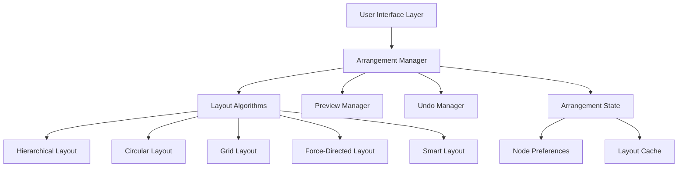

# Design Document

## Overview

The improved node arrangement system will enhance the existing Control Loop Designer webapp by providing intelligent, flexible, and user-friendly node positioning capabilities. The system will build upon the current React Flow implementation while introducing advanced layout algorithms, user preferences, and real-time preview functionality.

The design focuses on creating a modular architecture that can accommodate multiple arrangement strategies, preserve user preferences, and handle complex control diagram scenarios gracefully.

## Architecture

### High-Level Architecture



### Component Structure

The system will be organized into the following main components:

1. **ArrangementManager**: Central coordinator for all arrangement operations
2. **LayoutAlgorithms**: Collection of different arrangement strategies
3. **PreviewManager**: Handles real-time preview functionality
4. **UndoManager**: Manages arrangement history and undo operations
5. **ArrangementUI**: User interface components for arrangement controls

## Components and Interfaces

### ArrangementManager

```typescript
interface ArrangementManager {
  // Core arrangement methods
  arrangeNodes(strategy: LayoutStrategy, options?: ArrangementOptions): Promise<NodePosition[]>
  previewArrangement(strategy: LayoutStrategy, options?: ArrangementOptions): PreviewResult
  applyArrangement(positions: NodePosition[]): void
  cancelPreview(): void
  
  // Node locking and selection
  lockNodes(nodeIds: string[]): void
  unlockNodes(nodeIds: string[]): void
  arrangeSelectedNodes(nodeIds: string[], strategy: LayoutStrategy): Promise<NodePosition[]>
  
  // Undo/Redo functionality
  undo(): void
  redo(): void
  canUndo(): boolean
  canRedo(): boolean
}

interface ArrangementOptions {
  spacing?: SpacingConfig
  alignment?: AlignmentConfig
  respectLocked?: boolean
  selectedOnly?: boolean
  preserveAspectRatio?: boolean
}

interface SpacingConfig {
  nodeSpacing: number
  layerSpacing: number
  minSpacing: number
  maxSpacing: number
}

interface NodePosition {
  id: string
  x: number
  y: number
  locked?: boolean
}
```

### Layout Algorithms

Each layout algorithm will implement a common interface:

```typescript
interface LayoutAlgorithm {
  name: string
  description: string
  arrange(nodes: Node[], edges: Edge[], options: ArrangementOptions): Promise<NodePosition[]>
  validateInput(nodes: Node[], edges: Edge[]): ValidationResult
  getDefaultOptions(): ArrangementOptions
}

// Specific algorithm implementations
class HierarchicalLayout implements LayoutAlgorithm {
  // Arranges nodes in layers based on signal flow direction
  // Minimizes edge crossings between layers
}

class CircularLayout implements LayoutAlgorithm {
  // Positions nodes in circular patterns
  // Ideal for feedback control systems
}

class GridLayout implements LayoutAlgorithm {
  // Aligns nodes to a regular grid
  // Provides clean, structured appearance
}

class ForceDirectedLayout implements LayoutAlgorithm {
  // Uses physics simulation for natural positioning
  // Good for complex interconnected systems
}

class SmartLayout implements LayoutAlgorithm {
  // Intelligent hybrid approach
  // Analyzes diagram structure and chooses optimal strategy
}
```

### Preview Manager

```typescript
interface PreviewManager {
  startPreview(positions: NodePosition[]): void
  updatePreview(positions: NodePosition[]): void
  endPreview(apply: boolean): void
  isPreviewActive(): boolean
  getPreviewPositions(): NodePosition[]
}

interface PreviewResult {
  positions: NodePosition[]
  movedNodes: string[]
  quality: LayoutQuality
  warnings: string[]
}

interface LayoutQuality {
  edgeCrossings: number
  totalEdgeLength: number
  nodeOverlaps: number
  score: number // 0-100, higher is better
}
```

### Arrangement UI Components

```typescript
// Main arrangement toolbar component
interface ArrangementToolbar {
  strategies: LayoutStrategy[]
  currentStrategy: LayoutStrategy
  onStrategyChange: (strategy: LayoutStrategy) => void
  onArrange: () => void
  onPreview: () => void
  onUndo: () => void
  onRedo: () => void
}

// Strategy selection dropdown
interface StrategySelector {
  strategies: LayoutStrategy[]
  selected: LayoutStrategy
  onSelect: (strategy: LayoutStrategy) => void
  showPreview: boolean
}

// Options panel for fine-tuning
interface ArrangementOptions {
  spacing: SpacingConfig
  alignment: AlignmentConfig
  onOptionsChange: (options: ArrangementOptions) => void
}
```

## Data Models

### Core Data Structures

```typescript
interface LayoutStrategy {
  id: string
  name: string
  description: string
  icon: string
  algorithm: LayoutAlgorithm
  defaultOptions: ArrangementOptions
}

interface ArrangementState {
  currentStrategy: LayoutStrategy
  isPreviewActive: boolean
  previewPositions: NodePosition[]
  lockedNodes: Set<string>
  history: ArrangementHistory[]
  historyIndex: number
}

interface ArrangementHistory {
  timestamp: number
  positions: NodePosition[]
  strategy: LayoutStrategy
  description: string
}

interface DiagramAnalysis {
  sourceNodes: string[]
  sinkNodes: string[]
  layers: string[][]
  cycles: string[][]
  components: string[][]
  complexity: number
}
```

### Node Enhancement

Extend existing node data structure to support arrangement features:

```typescript
interface EnhancedNodeData extends NodeData {
  locked?: boolean
  layer?: number
  component?: number
  originalPosition?: { x: number, y: number }
  arrangementMetadata?: {
    lastArranged: number
    strategy: string
    manuallyMoved: boolean
  }
}
```

## Error Handling

### Validation and Error Recovery

```typescript
interface ValidationResult {
  isValid: boolean
  errors: ValidationError[]
  warnings: ValidationWarning[]
}

interface ValidationError {
  type: 'CIRCULAR_DEPENDENCY' | 'DISCONNECTED_GRAPH' | 'INVALID_NODE' | 'MISSING_EDGES'
  message: string
  affectedNodes: string[]
}

class ArrangementError extends Error {
  constructor(
    message: string,
    public readonly type: string,
    public readonly recoverable: boolean,
    public readonly fallbackStrategy?: LayoutStrategy
  ) {
    super(message)
  }
}
```

### Error Handling Strategy

1. **Input Validation**: Validate diagram structure before arrangement
2. **Graceful Degradation**: Fall back to simpler algorithms if complex ones fail
3. **User Feedback**: Provide clear error messages and suggested solutions
4. **Recovery Options**: Offer alternative arrangements when primary strategy fails

## Testing Strategy

### Unit Testing

- **Algorithm Testing**: Test each layout algorithm with various diagram structures
- **State Management**: Verify arrangement state transitions and history management
- **Validation Logic**: Test input validation and error detection
- **Preview Functionality**: Test preview generation and application

### Integration Testing

- **React Flow Integration**: Test integration with existing React Flow components
- **UI Interactions**: Test user interface components and event handling
- **Performance Testing**: Measure arrangement performance with large diagrams
- **Cross-browser Compatibility**: Ensure consistent behavior across browsers

### Test Scenarios

```typescript
describe('Arrangement System', () => {
  describe('Hierarchical Layout', () => {
    it('should arrange simple linear flow correctly')
    it('should handle multiple input/output nodes')
    it('should minimize edge crossings')
    it('should respect locked node positions')
  })
  
  describe('Preview System', () => {
    it('should show preview without affecting actual positions')
    it('should highlight nodes that will be moved')
    it('should calculate layout quality metrics')
  })
  
  describe('Undo/Redo', () => {
    it('should restore previous positions on undo')
    it('should maintain history stack correctly')
    it('should handle multiple consecutive arrangements')
  })
})
```

## Performance Considerations

### Optimization Strategies

1. **Lazy Loading**: Load layout algorithms on demand
2. **Caching**: Cache arrangement results for similar diagram structures
3. **Debouncing**: Debounce preview updates during user interactions
4. **Web Workers**: Use web workers for complex layout calculations
5. **Incremental Updates**: Only recalculate affected portions when possible

### Memory Management

- Limit arrangement history size to prevent memory leaks
- Clean up preview states when not needed
- Use object pooling for frequently created/destroyed objects
- Implement garbage collection for cached layout results

## Integration Points

### React Flow Integration

The system will integrate with the existing React Flow setup:

```typescript
// Enhanced App.tsx integration
const App = () => {
  const [arrangementManager] = useState(() => new ArrangementManager())
  
  // Existing React Flow state
  const [nodes, setNodes, onNodesChange] = useNodesState([])
  const [edges, setEdges, onEdgesChange] = useEdgesState([])
  
  // New arrangement state
  const [arrangementState, setArrangementState] = useState<ArrangementState>()
  
  // Integration callbacks
  const handleArrangement = useCallback(async (strategy: LayoutStrategy) => {
    const positions = await arrangementManager.arrangeNodes(strategy)
    setNodes(nodes => updateNodePositions(nodes, positions))
  }, [arrangementManager, setNodes])
  
  return (
    <div>
      <ArrangementToolbar 
        onArrange={handleArrangement}
        arrangementManager={arrangementManager}
      />
      <ReactFlow
        nodes={nodes}
        edges={edges}
        // ... existing props
      />
    </div>
  )
}
```

### Menu Integration

Extend the existing menubar with arrangement options:

```typescript
// Enhanced SiteHeader.tsx
<MenubarMenu>
  <MenubarTrigger>Arranjar</MenubarTrigger>
  <MenubarContent>
    <MenubarItem onClick={() => arrange('hierarchical')}>
      Hierárquico
      <MenubarShortcut>Ctrl+Shift+H</MenubarShortcut>
    </MenubarItem>
    <MenubarItem onClick={() => arrange('circular')}>
      Circular
      <MenubarShortcut>Ctrl+Shift+C</MenubarShortcut>
    </MenubarItem>
    <MenubarItem onClick={() => arrange('grid')}>
      Grade
      <MenubarShortcut>Ctrl+Shift+G</MenubarShortcut>
    </MenubarItem>
    <MenubarSeparator/>
    <MenubarItem onClick={() => togglePreview()}>
      Visualizar Prévia
    </MenubarItem>
    <MenubarItem onClick={() => lockSelectedNodes()}>
      Travar Selecionados
    </MenubarItem>
  </MenubarContent>
</MenubarMenu>
```

This design provides a comprehensive foundation for implementing the improved node arrangement system while maintaining compatibility with the existing codebase and ensuring extensibility for future enhancements.