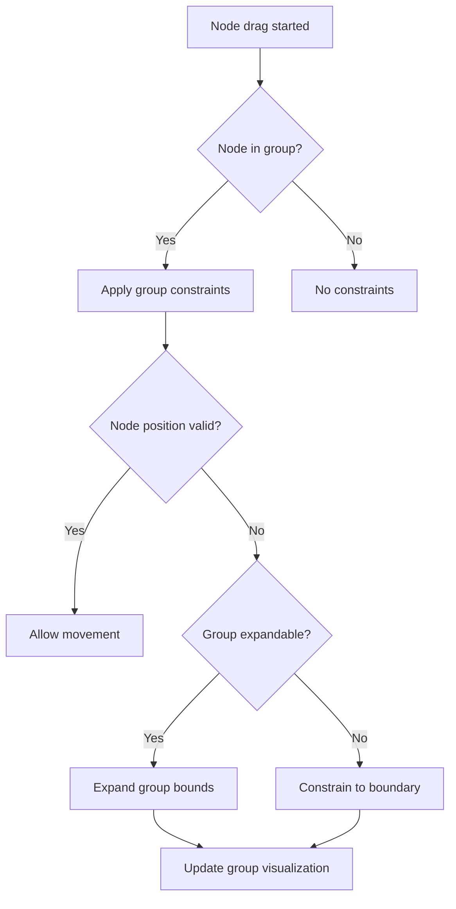
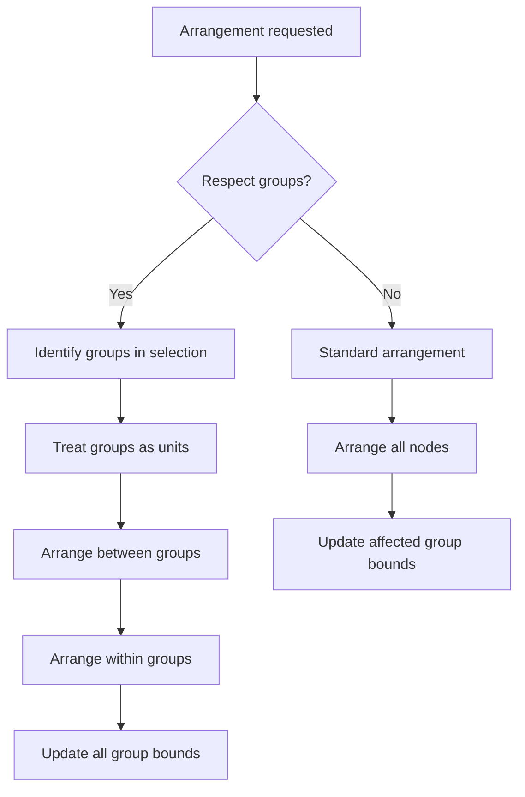

# Node Grouping Improvements Design Document

## Overview

The improved node grouping feature enhances the existing grouping system in the Control Loop Designer Webapp to provide a more intuitive and robust user experience. This design addresses several key issues with the current implementation:

1. Context menu positioning and triggering
2. Node containment within group boundaries
3. Group selection and manipulation
4. Arrangement method compatibility with groups
5. Visual feedback for group interactions

The design builds upon the existing React Flow-based canvas system and extends the current group management functionality while maintaining backward compatibility with existing diagrams.

## Architecture

### Core Components

The improved grouping system will enhance several key architectural components:

1. **Group Renderer**: Enhanced to provide better selection handling and visual feedback
2. **Group Manager**: Extended with containment logic and improved bounds management
3. **Selection Handler**: Modified to properly handle group selection and multi-selection
4. **Context Menu System**: Improved to work correctly with selected nodes and groups
5. **Arrangement Integration**: Enhanced to respect group boundaries during layout operations

### Integration Points

- **React Flow Canvas**: Groups will continue to render as custom background elements
- **Node Dragging System**: Enhanced to respect group boundaries
- **Context Menu System**: Modified to trigger from selected nodes
- **Arrangement System**: Extended to treat groups as cohesive units

## Components and Interfaces

### Enhanced Group Renderer

```typescript
interface GroupRendererProps {
  group: NodeGroup;
  isSelected: boolean;
  onSelect: (groupId: string, event?: React.MouseEvent) => void;
  onTitleEdit: (groupId: string, newTitle: string) => void;
  onTitleEditStart?: (groupId: string) => void;
  onTitleEditEnd?: (groupId: string) => void;
  onContextMenu?: (event: React.MouseEvent, groupId: string) => void;
  onGroupDrag?: (groupId: string, delta: { dx: number; dy: number }) => void;
  // New props
  isHoverable?: boolean;
  isDraggable?: boolean;
  showSelectionHandles?: boolean;
}
```

The GroupRenderer will be enhanced with:
- Improved click handling for reliable selection
- Visual hover states for better interaction feedback
- Selection handles for group manipulation
- Better drag event handling to prevent event propagation issues

**Design Rationale**: The current GroupRenderer has issues with event propagation and selection handling. The enhanced version will provide clearer visual feedback and more reliable interaction handling.

### Extended Group Manager

```typescript
interface GroupManager {
  // Existing methods
  createGroup(params: CreateGroupParams): GroupOperationResult;
  updateGroupTitle(groupId: string, newTitle: string): GroupOperationResult;
  deleteGroup(groupId: string): GroupOperationResult;
  
  // Enhanced methods
  calculateGroupBounds(nodeIds: string[], nodes: Node[], options?: BoundsCalculationOptions): Bounds;
  updateGroupBounds(group: NodeGroup, nodes: Node[]): NodeGroup;
  
  // New methods
  isNodePositionWithinGroup(nodeId: string, position: XYPosition, group: NodeGroup): boolean;
  constrainNodePositionToGroup(nodeId: string, position: XYPosition, group: NodeGroup): XYPosition;
  expandGroupToFitNode(group: NodeGroup, nodeId: string, position: XYPosition): NodeGroup;
  getGroupsForArrangement(groups: NodeGroup[], nodes: Node[]): ArrangementGroup[];
}
```

**Design Rationale**: The GroupManager needs additional methods to enforce node containment within groups and to support arrangement operations that respect group boundaries.

### Improved Context Menu System

```typescript
interface GroupContextMenuProps {
  open: boolean;
  position: { x: number, y: number };
  onClose: () => void;
  onGroup: () => void;
  onUngroup: () => void;
  // New props
  selectedNodes: string[];
  selectedGroups: string[];
  isGroupingPossible: boolean;
  isUngroupingPossible: boolean;
}

interface UseGroupContextMenuReturn {
  contextMenu: {
    open: boolean;
    position: { x: number, y: number };
    type: 'node' | 'group' | 'canvas' | null;
  };
  openNodeMenu: (event: React.MouseEvent, nodeIds: string[]) => void;
  openGroupMenu: (event: React.MouseEvent, groupId: string) => void;
  openCanvasMenu: (event: React.MouseEvent) => void;
  closeMenu: () => void;
}
```

**Design Rationale**: The context menu system needs to be enhanced to properly handle right-clicks on selected nodes and groups, with appropriate positioning and options based on the selection context.

### Group-Aware Node Dragging

```typescript
interface NodeDragConstraint {
  nodeId: string;
  groupId: string | null;
  originalPosition: XYPosition;
  constrainPosition: (position: XYPosition) => XYPosition;
}

interface UseNodeDragConstraintsReturn {
  getConstraintForNode: (nodeId: string) => NodeDragConstraint | null;
  updateConstraints: (nodes: Node[], groups: NodeGroup[]) => void;
}
```

**Design Rationale**: To enforce node containment within groups, we need a system that can constrain node dragging operations based on group boundaries.

### Group-Aware Arrangement System

```typescript
interface ArrangementGroup {
  id: string;
  nodeIds: string[];
  bounds: Bounds;
  treatAsUnit: boolean;
}

interface ArrangementOptions {
  respectGroups: boolean;
  arrangeWithinGroups: boolean;
  maintainGroupStructure: boolean;
}
```

**Design Rationale**: The arrangement system needs to be aware of groups and treat them as cohesive units during layout operations.

## Data Models

### Enhanced NodeGroup Model

```typescript
interface NodeGroup {
  id: string;
  title: string;
  nodeIds: string[];
  bounds: {
    x: number;
    y: number;
    width: number;
    height: number;
  };
  style: {
    backgroundColor: string;
    borderColor: string;
    borderRadius: number;
  };
  zIndex: number;
  // New properties
  isLocked: boolean;
  isCollapsed: boolean;
  minWidth: number;
  minHeight: number;
  padding: number;
  createdAt: number;
  updatedAt: number;
}
```

**Design Rationale**: Additional properties provide more control over group behavior and appearance, while maintaining backward compatibility with existing group data.

### Group Interaction State

```typescript
interface GroupInteractionState {
  hoveredGroupId: string | null;
  draggingGroupId: string | null;
  resizingGroupId: string | null;
  dragStartPosition: XYPosition | null;
  dragOffset: { x: number, y: number } | null;
  isMultiGroupOperation: boolean;
}
```

**Design Rationale**: Tracking interaction state helps provide appropriate visual feedback and behavior during group operations.

## Error Handling

### Node Containment Validation

- **Boundary Violation**: When a node is dragged beyond its group boundary, either constrain it or expand the group
- **Group Overlap**: Handle cases where groups overlap and a node could belong to multiple groups
- **Group Resizing**: Ensure group resizing operations maintain minimum size and proper containment of member nodes

### Group Selection Edge Cases

- **Nested Selection**: Handle cases where clicking could select multiple overlapping groups
- **Empty Space**: Ensure clicking on empty space within a group selects the group, not the canvas
- **Multi-Group Selection**: Handle selection of multiple groups with proper visual feedback

### Arrangement Conflicts

- **Group Constraints**: Handle cases where arrangement algorithms conflict with group containment rules
- **Nested Groups**: Provide clear behavior for arrangement of nested group structures
- **Partial Arrangements**: Allow arrangement of subsets of nodes while respecting group boundaries

## Testing Strategy

### Unit Tests

1. **Group Manager Extensions**
   - Test node containment logic with various edge cases
   - Verify group bounds calculation with different node arrangements
   - Test group expansion logic when nodes move near boundaries

2. **Context Menu Enhancements**
   - Test menu triggering from different selection states
   - Verify menu positioning relative to cursor and viewport
   - Test menu options based on selection context

3. **Node Dragging Constraints**
   - Test position constraints with different group shapes
   - Verify boundary enforcement during drag operations
   - Test group expansion behavior when configured

### Integration Tests

1. **Selection and Context Menu**
   - Test selection of nodes followed by context menu activation
   - Verify group creation from selected nodes via context menu
   - Test group selection and ungrouping via context menu

2. **Group Dragging and Containment**
   - Test dragging nodes within groups with boundary constraints
   - Verify group dragging moves all member nodes correctly
   - Test interaction between multiple overlapping groups

3. **Arrangement with Groups**
   - Test various arrangement algorithms with grouped nodes
   - Verify groups maintain integrity during arrangement
   - Test arrangement of nodes within groups vs. between groups

### Visual Testing

1. **Selection Feedback**
   - Verify visual highlighting of selected groups
   - Test hover states and interaction indicators
   - Verify selection handles appear correctly

2. **Drag Feedback**
   - Test visual feedback during group dragging
   - Verify boundary indicators when nodes approach group edges
   - Test error indicators for invalid operations

## Implementation Considerations

### Performance Optimization

- **Bounds Calculation**: Optimize group bounds calculations to minimize recalculations
- **Drag Constraints**: Implement efficient constraint checking for smooth dragging
- **Selection Handling**: Optimize selection state updates to prevent unnecessary re-renders

### Backward Compatibility

- **Data Model**: Ensure enhanced group model is compatible with existing saved diagrams
- **API Surface**: Maintain compatibility with existing group management functions
- **Visual Appearance**: Preserve the current visual style while adding new indicators

### Phased Implementation

The implementation can be broken down into phases to manage complexity:

1. **Phase 1**: Fix context menu triggering and positioning
2. **Phase 2**: Implement group selection improvements
3. **Phase 3**: Add node containment within groups
4. **Phase 4**: Integrate with arrangement system
5. **Phase 5**: Enhance visual feedback and interaction

This phased approach allows for incremental testing and validation of each component.

## Diagrams

### Group Selection and Interaction Flow

```mermaid
flowchart TD
    A[User clicks on canvas] -->|Click on group background| B[Select group]
    A -->|Click on node| C[Select node]
    A -->|Click on empty space| D[Clear selection]
    
    B -->|Right-click| E[Show group context menu]
    C -->|Right-click| F[Show node context menu]
    
    E -->|Select "Ungroup"| G[Ungroup operation]
    F -->|Multiple nodes selected| H[Show "Group" option]
    F -->|Single node selected| I[Hide "Group" option]
    
    H -->|Select "Group"| J[Create new group]
```

### Node Containment Logic



### Group-Aware Arrangement Process

