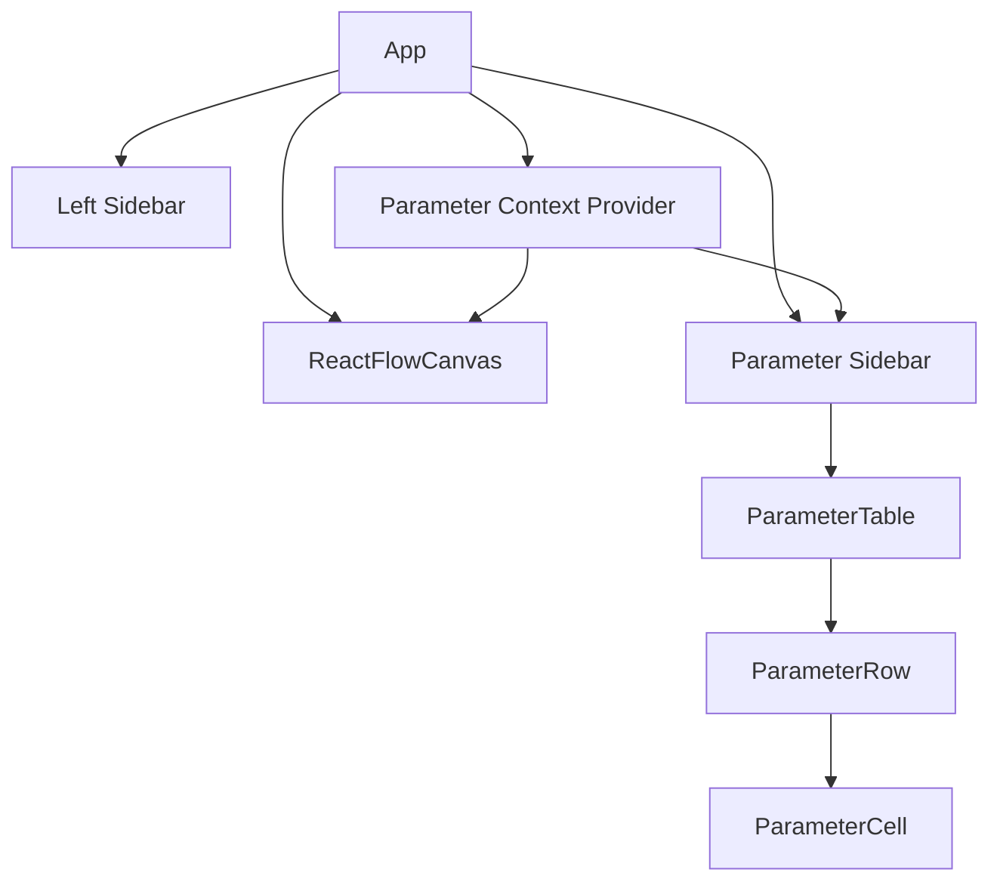

# Design Document

## Overview

The Parameter Sidebar feature will add a collapsible sidebar on the right side of the application that contains a data table for managing control system parameters. This component will allow users to create, edit, and manage parameters that can be referenced by control blocks in the diagram. The feature will also include validation to ensure that all parameters referenced in nodes (P1, P2, P3, P4) are properly defined in the parameter table.

## Architecture

The Parameter Sidebar will be implemented as a React component that integrates with the existing application structure. It will follow the same design patterns used in the current left sidebar implementation, ensuring consistency in the user interface.

### Component Integration

The Parameter Sidebar will be integrated into the main App component alongside the existing left sidebar. The application layout will be modified to accommodate both sidebars while maintaining the central ReactFlow canvas area.



## Components and Interfaces

### ParameterContextProvider

A React context provider that will manage the state of parameters and provide methods for adding, editing, and deleting parameters. It will also handle validation and checking for parameter references in nodes.

```typescript
interface Parameter {
  id: string;
  name: string;  // Must start with # and be exactly 6 chars
  value: string;
  description: string;
}

interface ParameterContextType {
  parameters: Parameter[];
  addParameter: () => void;
  updateParameter: (id: string, field: keyof Parameter, value: string) => void;
  deleteParameter: (id: string) => void;
  validateParameter: (parameter: Parameter) => { valid: boolean; error?: string };
  checkNodeReferences: () => { valid: boolean; undefinedParams: string[] };
  getParameterByName: (name: string) => Parameter | undefined;
}
```

### ParameterSidebar

The main sidebar component that will contain the parameter table and controls for adding new parameters.

```typescript
interface ParameterSidebarProps {
  isOpen: boolean;
  onToggle: () => void;
}
```

### ParameterTable

A component that renders the table of parameters with editable cells.

```typescript
interface ParameterTableProps {
  parameters: Parameter[];
  onUpdate: (id: string, field: keyof Parameter, value: string) => void;
  onDelete: (id: string) => void;
}
```

### ParameterRow

A component that renders a single row in the parameter table.

```typescript
interface ParameterRowProps {
  parameter: Parameter;
  onUpdate: (field: keyof Parameter, value: string) => void;
  onDelete: () => void;
  validationErrors: Record<keyof Parameter, string | undefined>;
}
```

## Data Models

### Parameter

```typescript
interface Parameter {
  id: string;        // Unique identifier
  name: string;      // Parameter name (must start with # and be exactly 6 chars)
  value: string;     // Parameter value
  description: string; // Parameter description
}
```

### ParameterState

```typescript
interface ParameterState {
  parameters: Parameter[];
  validationErrors: Record<string, Record<keyof Parameter, string | undefined>>;
}
```

### DiagramState (Extended)

The existing diagram state will be extended to include parameters:

```typescript
interface DiagramState {
  // Existing properties
  nodes: Node[];
  edges: Edge[];
  drawingData: DrawingData;
  groupData: GroupData;
  
  // New property
  parameters: Parameter[];
}
```

## Error Handling

### Parameter Validation

1. **Name Validation**:
   - Must start with "#"
   - Must be exactly 6 characters in total
   - Must be unique among all parameters

2. **Value Validation**:
   - Must not be empty
   - Should be a valid number (optional, depending on requirements)

3. **Error Display**:
   - Validation errors will be displayed inline in the table cells
   - A red border will highlight invalid fields
   - Tooltip will show the specific error message

### Node Reference Validation

1. **Reference Detection**:
   - Scan all nodes for references to parameters (P1, P2, P3, P4)
   - Check if each referenced parameter exists in the parameter table
   - Display warnings for undefined parameters

2. **Warning Display**:
   - Show a warning icon in the sidebar when undefined parameters are detected
   - Provide a list of undefined parameters when the warning icon is clicked
   - Highlight nodes with undefined parameters

## Testing Strategy

### Unit Tests

1. **Parameter Context Tests**:
   - Test parameter addition, update, and deletion
   - Test parameter validation logic
   - Test node reference checking

2. **Component Tests**:
   - Test ParameterSidebar rendering and toggling
   - Test ParameterTable rendering and interactions
   - Test ParameterRow editing and validation

### Integration Tests

1. **Sidebar Integration**:
   - Test integration with the main App component
   - Test interaction between both sidebars
   - Test canvas resizing when sidebars are toggled

2. **Node-Parameter Integration**:
   - Test parameter reference detection in nodes
   - Test parameter tooltips on node hover
   - Test validation during diagram export

### End-to-End Tests

1. **Parameter Workflow**:
   - Test complete workflow of adding, editing, and deleting parameters
   - Test parameter validation during editing
   - Test parameter persistence when saving/loading diagrams

2. **Diagram Validation**:
   - Test validation of diagram with undefined parameters
   - Test warning display and resolution workflow